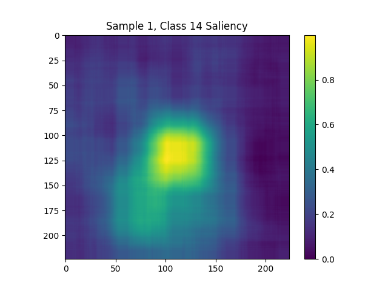

# 🧠 Explainable AI with Grad-CAM (Deep Learning Lab 2025)

This project was completed as part of the **Deep Learning Lab Challenge 2025** at  
**Technische Universität Braunschweig (TU Braunschweig)**.  

The task: train an **image classifier** and provide **explainable predictions** using saliency maps.

---

## 📂 Repository Contents
Due to cluster restrictions, the full training code cannot be shared here.  
Instead, this repository contains:

- ✅ Final presentation slides  
- ✅ Evaluation results (Classification & Explainability metrics)  
- ✅ A Grad-CAM demo notebook using pretrained **ResNet-50**  

---

## 🚀 Project Overview
- Trained **ResNet-50** on the **Pascal VOC** dataset (20 object classes).  
- Implemented **Grad-CAM** to generate class-specific saliency maps.  
- Evaluated explanations with multiple explainability metrics:  
  - **iAUC** (Faithfulness)  
  - **Mean IoU** (Alignment with segmentation masks)  
  - **Pointing Game** (Localization accuracy)  

---

## 📊 Results
| Metric              | Score  |
|----------------------|--------|
| **Test Accuracy**    | 97.8%  |
| **AUROC**            | 98.4%  |
| **iAUC (Faithfulness)**  | 0.73   |
| **Mean IoU (Alignment)** | 0.29   |
| **Pointing Game**        | 0.53   |

---

## 🔍 Example Saliency Maps

Grad-CAM highlights the most important regions used by the model:  

<p align="center">
  
</p>  

*Example: Grad-CAM saliency map for Class 14.*  

- Bright **yellow regions** → strong model focus  
- Darker areas → less influence  
- Helps to understand **which parts of the image drive the decision**  

---

## 📂 Repository Structure
- `slides/` → Final presentation slides  
- `notebooks/` → Small Grad-CAM demo (PyTorch, ResNet-50)  
- `results/` → Sample saliency maps and metrics  
- `docs/` → Certificate of completion (Deep Learning Lab 2025)  

---

## 📜 Certificate
This project was officially recognized as part of my **Deep Learning Lab coursework**.

👉 [View Certificate (PDF)](docs/deep_learning_lab_certificate.pdf)

---

## 🛠 Requirements
Install dependencies with:  
```bash
pip install -r requirements.txt
